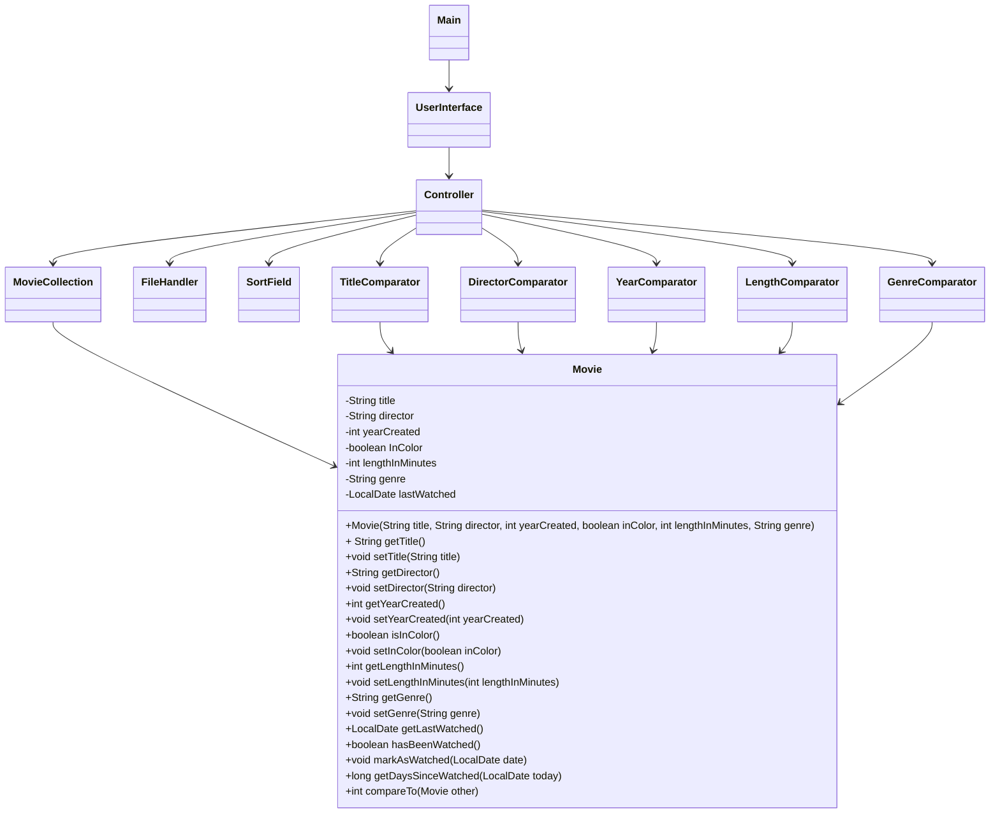

# Klassediagram – Filmsamling

```mermaid
classDiagram

class Main
class UserInterface
class Controller
class MovieCollection {
    
}
class Movie {
    -String title
    -String director
    -int yearCreated
    -boolean InColor
    -int lengthInMinutes
    -String genre
    -LocalDate lastWatched
    
    +Movie(String title, String director, int yearCreated, boolean inColor, int lengthInMinutes, String genre)
    + String getTitle()
    +void setTitle(String title)
    +String getDirector()
    +void setDirector(String director)
    +int getYearCreated()
    +void setYearCreated(int yearCreated)
    +boolean isInColor()
    +void setInColor(boolean inColor)
    +int getLengthInMinutes()
    +void setLengthInMinutes(int lengthInMinutes)
    +String getGenre()
    +void setGenre(String genre)
    +LocalDate getLastWatched()
    +boolean hasBeenWatched()
    +void markAsWatched(LocalDate date)
    +long getDaysSinceWatched(LocalDate today)
    +int compareTo(Movie other)
}
class FileHandler
class SortField
class TitleComparator
class DirectorComparator
class YearComparator
class LengthComparator
class GenreComparator

Main --> UserInterface
UserInterface --> Controller
Controller --> MovieCollection
Controller --> FileHandler
MovieCollection --> Movie

Controller --> SortField
Controller --> TitleComparator
Controller --> DirectorComparator
Controller --> YearComparator
Controller --> LengthComparator
Controller --> GenreComparator

TitleComparator --> Movie
DirectorComparator --> Movie
YearComparator --> Movie
LengthComparator --> Movie
GenreComparator --> Movie
```