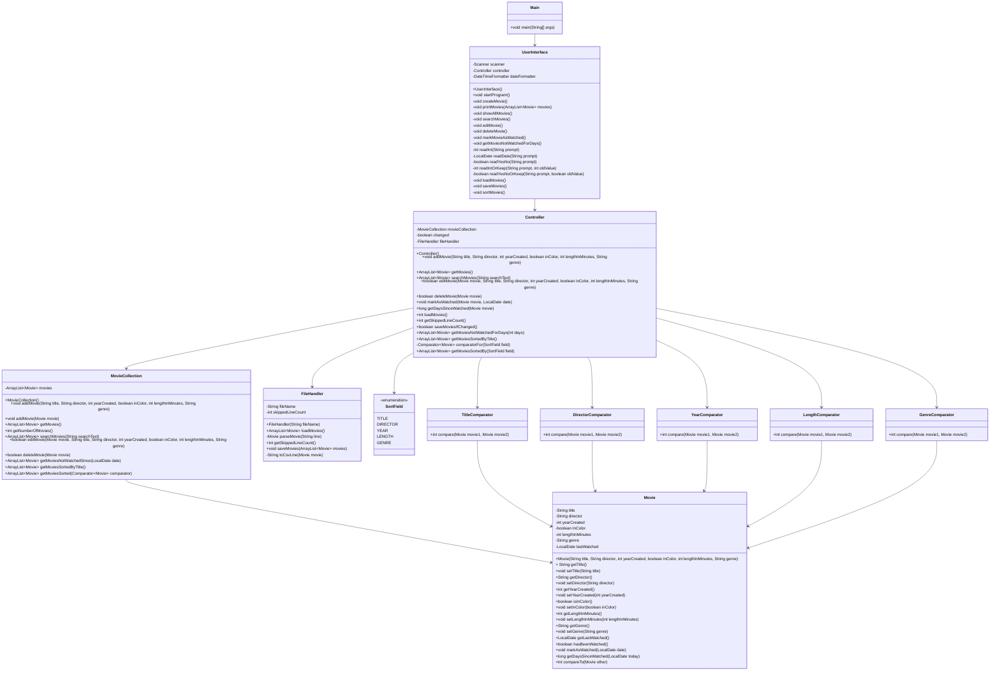

# Klassediagram – Filmsamling

```mermaid
classDiagram

class Main {
    +void main(String[] args)
}
class UserInterface {
    -Scanner scanner
    -Controller controller
    -DateTimeFormatter dateFormatter

    +UserInterface()
    +void startProgram()
    -void createMovie()
    -void printMovies(ArrayList~Movie~ movies)
    -void showAllMovies()
    -void searchMovies()
    -void editMovie()
    -void deleteMovie()
    -void markMovieAsWatched()
    -void getMoviesNotWatchedForDays()
    -int readInt(String prompt)
    -LocalDate readDate(String prompt)
    -boolean readYesNo(String prompt)
    -int readIntOrKeep(String prompt, int oldValue)
    -boolean readYesNoOrKeep(String prompt, boolean oldValue)
    -void loadMovies()
    -void saveMovies()
    -void sortMovies()
}
class Controller {
    -MovieCollection movieCollection
    -boolean changed
    -FileHandler fileHandler

    +Controller()
    +void addMovie(String title, String director, int yearCreated, boolean inColor, int lengthInMinutes, String genre)
    +ArrayList~Movie~ getMovies()
    +ArrayList~Movie~ searchMovies(String searchText)
    +boolean editMovie(Movie movie, String title, String director, int yearCreated, boolean inColor, int lengthInMinutes, String genre)
    +boolean deleteMovie(Movie movie)
    +void markAsWatched(Movie movie, LocalDate date)
    +long getDaysSinceWatched(Movie movie)
    +int loadMovies()
    +int getSkippedLineCount()
    +boolean saveMoviesIfChanged()
    +ArrayList~Movie~ getMoviesNotWatchedForDays(int days)
    +ArrayList~Movie~ getMoviesSortedByTitle()
    -Comparator~Movie~ comparatorFor(SortField field)
    +ArrayList~Movie~ getMoviesSortedBy(SortField field)
}
class MovieCollection {
    -ArrayList~Movie~ movies

    +MovieCollection()
    +void addMovie(String title, String director, int yearCreated, boolean inColor, int lengthInMinutes, String genre)
    +void addMovie(Movie movie)
    +ArrayList~Movie~ getMovies()
    +int getNumberOfMovies()
    +ArrayList~Movie~ searchMovies(String searchText)
    +boolean editMovie(Movie movie, String title, String director, int yearCreated, boolean inColor, int lengthInMinutes, String genre)
    +boolean deleteMovie(Movie movie)
    +ArrayList~Movie~ getMoviesNotWatchedSince(LocalDate date)
    +ArrayList~Movie~ getMoviesSortedByTitle()
    +ArrayList~Movie~ getMoviesSorted(Comparator~Movie~ comparator)
    
}

class Movie {
    -String title
    -String director
    -int yearCreated
    -boolean InColor
    -int lengthInMinutes
    -String genre
    -LocalDate lastWatched
    
    +Movie(String title, String director, int yearCreated, boolean inColor, int lengthInMinutes, String genre)
    + String getTitle()
    +void setTitle(String title)
    +String getDirector()
    +void setDirector(String director)
    +int getYearCreated()
    +void setYearCreated(int yearCreated)
    +boolean isInColor()
    +void setInColor(boolean inColor)
    +int getLengthInMinutes()
    +void setLengthInMinutes(int lengthInMinutes)
    +String getGenre()
    +void setGenre(String genre)
    +LocalDate getLastWatched()
    +boolean hasBeenWatched()
    +void markAsWatched(LocalDate date)
    +long getDaysSinceWatched(LocalDate today)
    +int compareTo(Movie other)
}
class FileHandler {
    -String fileName
    -int skippedLineCount

    +FileHandler(String fileName)
    +ArrayList~Movie~ loadMovies()
    -Movie parseMovie(String line)
    +int getSkippedLineCount()
    +void saveMovies(ArrayList~Movie~ movies)
    -String toCsvLine(Movie movie)
}
class SortField {
    <<enumeration>>
    TITLE
    DIRECTOR
    YEAR
    LENGTH
    GENRE
}
class TitleComparator {
    +int compare(Movie movie1, Movie movie2)
}
class DirectorComparator {
    +int compare(Movie movie1, Movie movie2)
}
class YearComparator {
    +int compare(Movie movie1, Movie movie2)
}
class LengthComparator {
    +int compare(Movie movie1, Movie movie2)
}
class GenreComparator {
    +int compare(Movie movie1, Movie movie2)
}

Main --> UserInterface
UserInterface --> Controller
Controller --> MovieCollection
Controller --> FileHandler
MovieCollection --> Movie

Controller --> SortField
Controller --> TitleComparator
Controller --> DirectorComparator
Controller --> YearComparator
Controller --> LengthComparator
Controller --> GenreComparator

TitleComparator --> Movie
DirectorComparator --> Movie
YearComparator --> Movie
LengthComparator --> Movie
GenreComparator --> Movie
```